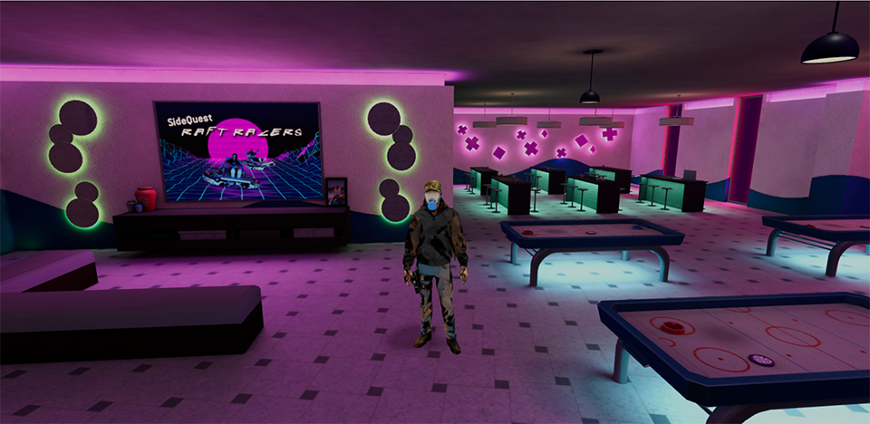
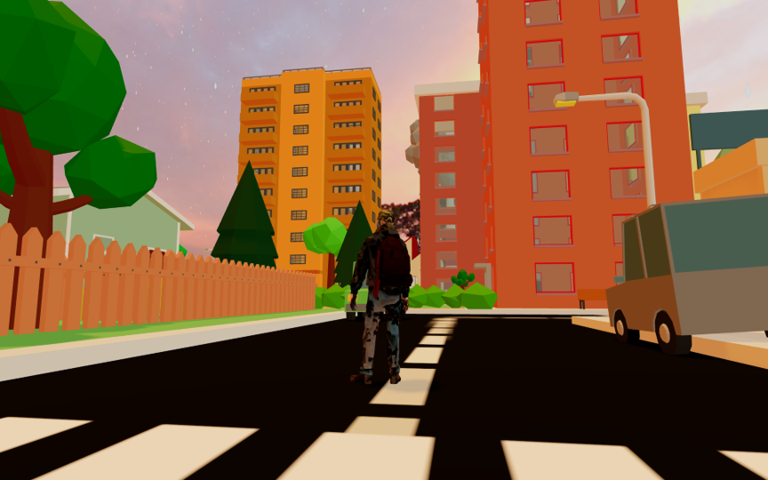
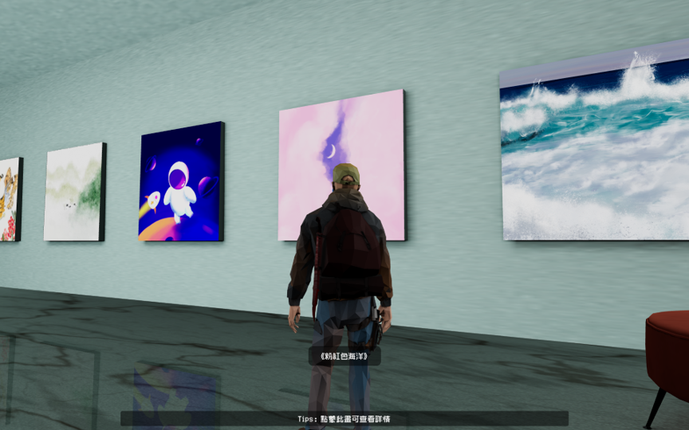
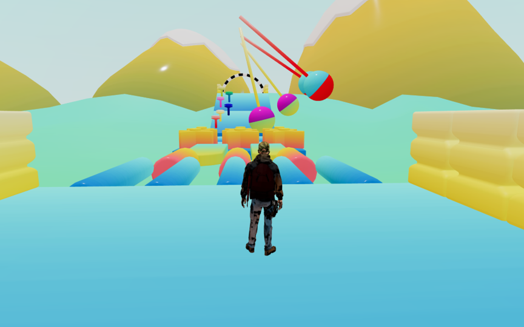

<h1 align="center">《virtual city》</h1>

<p align="center">





</p>

<p align="center">
<b>《virtual city》</b> 🎮是一款基於Three.js技術堆疊開發的遊戲，為玩家提供身臨其境的虛擬世界。在遊戲中，您將體驗到場景和角色之間精確的碰撞偵測，讓您的遊戲體驗更加真實流暢。此外，遊戲還支援雙視角切換，讓你可以在第一人稱和第三人稱視角之間自由切換，更好地探索遊戲世界。為了提高遊戲效能，也巧妙地應用了相機遮蔽優化，為您提供更流暢的遊戲視覺和動畫。此外，遊戲也融入了NES遊戲模擬元素，讓您重溫經典懷舊遊戲體驗。無論是探索未知的世界，還是挑戰各種遊戲任務，​​你都可以在《虛擬城市》中找到樂趣和挑戰！
</p>

## 如何操作?
行走：`W`/`S`/`A`/`D`

跳躍：`空格`

控制視角：`滑鼠左鍵`

切換人稱視角: `V`

觸發互動: `F`

切換天氣、時間、角色模式、角色速度: `T`

飛行模式下: `Q`上升、 `E`下降

傳送到美術館、遊樂場、遊戲廳: `點擊由廣場傳送門傳送`

## 特色

- [x] 雙人稱切換
- [x] 高效能碰撞偵測
- [x] 第三人稱相機遮蔽處理
- [x] 交互盒子偵測
- [x] NES遊戲模擬
- [x] 自由切換天氣、時間、角色模式、角色速度
- [x] 互動提示、雷射提示
- [x] 美術館、遊樂場、廣場等場景

## 說明
本專案採用`Vue3` + `TypeScript` + `three.js` + `tailwindcss` + `paina` 等技術開發。

## 目錄結構說明
```text
|── src # 原始碼
| |── application # 遊戲核心原始碼部分
| | |── audio # 音訊類別（建立位置音訊）
| | |── character # 人物角色類別（人物模型控制）
| | |── control # 鍵盤控制類別（鍵盤按鍵狀態管理）
| | |── core # 核心基礎類別（包括camera、renderer、scene等）
| | |── emitter # 事件分發類別（各類事件的分發）
| | |── environment # 場景類別（建立地圖模型、燈光、場景貼圖）
| | | |── index.ts # 場景管理類別 plaze、gallery、entertainment、platground
| | | |── rainscene.ts # 下雨場景類別
| | | |── snowscene.ts # 雪場景類別
| | | └── teleoirter.ts #傳送門類別
| | │── interactionDetection # 互動偵測類別（角色盒子與互動盒子相交的觸發偵測）
| | │── lib
| | | └── Reflector.ts # 反射器類別（角色與互動盒子的反射偵測）、美術館地面
| | │── loader # 載入器類別（fbx、glb、audio、texture等載入器管理）
| | ├── maps 管理遊樂場物件移動、旋轉、擺動
| | ├── rayCasterControls # 射線偵測控制類別（角色與互動盒子的射線偵測），點擊、自動檢測
| | │── utils # 工具函數
| | | └── typeAssert.ts # 類型推導工具函數
| | │── world # 遊戲核心類別（用於管理遊戲世界中的核心元素，包括環境、角色、互動偵測和音訊等元件）
| | └── Constants.ts # 常數定義（定義模型/貼圖/媒體資源位址、分發事件名稱等）
│ ├── assets # 資源資料夾
| | │── audio # 音訊檔案
| | │── font # 字型文件
| | │── img # 圖片文件
| | │── models # 模型文件
| | │── nes # nes遊戲文件
| | ├── shaders # 傳送門shader文件
| | ├── vue # 前端圖片文件
| | └── main.css # 全域樣式
| |── components # vue組件
| | │── BoardsInfo.vue # 美術館畫框組件
| | │── LoadProgress.vue # 載入元件
| | │── NesGameDialog.vue # nes遊戲彈跳窗組件（運行nes遊戲）
| | │── NotifyTips.vue # 互動提示元件
| | │── PreviewTooltips.vue # 雷射提示組件
| | └── Tool.vue # 工具組件（時間、天氣、角色模式、角色、音樂等控制）
│ |── router # 路由管理
| |── views # 頁面管理
| | ├── Entertainment.vue # 娛樂頁面
| | ├── Grallery.vue # 美術館頁面
| | ├── Platground.vue # 遊樂場頁面
| | ├── Plaza.vue # 廣場頁面
│ ├── App.vue # 入口頁
│ └── main.js # 入口檔案（載入元件、全域樣式、初始化等）
```

## 安裝

```sh
npm install
```

## 專案啟動

```sh
npm run dev
```

## 建置打包

```sh
npm run build
```
